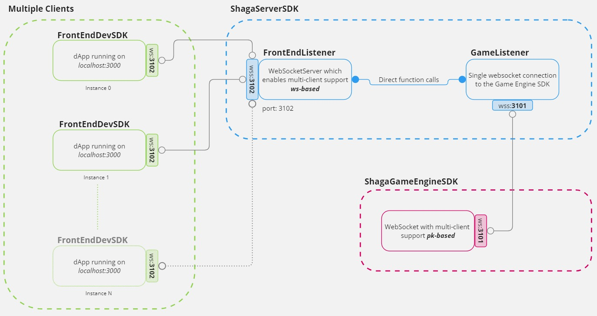
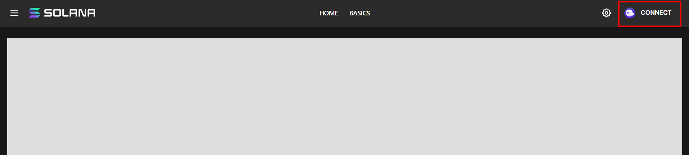

# Shaga Environment SDK

The `Shaga SDK` aims to provide developers with the ability to interact with the Shaga environment directly from their games built in Unreal Engine.

By leveraging this SDK, developers can enhance their games with the Solana web3 environment interaction.

### Architecture
`ShagaSDK` is composed by three entities:
- `ShagaServerSDK`[[clone](https://github.com/ShagaDAO/ServerSDK)]: a fork of this [solana-labs repo](https://github.com/solana-developers/compressed-nfts), which exposes functionalities to games through a local http server written in `Nodejs`
- `FrontEndDevSDK`[[clone](https://github.com/ShagaDAO/FrontEndDevSDK)]: a *Solana dApp* written in `Nextjs`
- `ShagaGameEngineSDK`: the GameEngine specific distribution
    - [ShagaSDK for Unity](https://github.com/ShagaDAO/CSharpSDK) written in `C#`
    - [ShagaSDK for Unreal Engine]( https://github.com/ShagaDAO/UEPluginSDK) written in `C++`

>Each `ShagaGameEngineSDK` opens a bi-directional `WebSocket` connection on the port `3101`, thus to the `ShagaServerSDK` entity.

>Each `ShagaDevFrontEnd` dApp opens a bi-directional `WebSocket` on the port `3102`, thus to the `ShagaServerSDK` entity.

#### Overall architecture


## Getting Started
To get started with the Shaga Environment SDK, after having cloned the two repositories mentioned above, do the following:

### I. module `ShagaServerSDK`
Install `yarn` as packet manager, install packages and run the server.
```bash
  $ ~ npm install -g yarn   # install yarn globally 
  $ ~ yarn install          # install project packages
  $ ~ yarn dev              # run the server
```
This will print the following prompt:
```
Game Connection Listener started on port: 3101
FrontEnd Connection Listener started on port: 3102
```
### II. module `ShagaDevFrontEnd`

```bash
  $ ~ yarn install  # install project packages
  $ ~ yarn dev      # run the frontend
```

Open http://localhost:3000 on the browser and connect your wallet through the UI.


### III. module `Shaga` Unreal Engine plugin
1. Put the `Shaga/` folder under your `YourGame/Plugins/` folder.
2. Add the `Shaga` string to your `PublicDependencyModuleNames` inside `YourGame.Build.cs`
3. Enable the `Shaga` plugin inside `YourGame.uproject`
4. Right-click on `YourGame.uproject` > *Generate Visual Studio Project Files*

## UE plugin taxonomy
#### The two most important classes are:
1. `UShagaGameInstanceSubsystem`
2. `UShagaLocalPlayerSubsystem` 
3. `UShagaServerProcessManager`

>The `ShagaGameInstanceSubsystem` opens and handles the `websocket` connection on the port `3101` to send/receive data to/from the `nodejs` webserver whose lifecycle is managed by the `ShagaServerProcessManager`.

>Each message received by the `ShagaGameInstanceSubsystem` contains the sender `PublicKey` thus can be redirected to the right `ShagaLocalPlayerSubsystem`, which represents as the authenticated player abstraction.

> Developers have to use the functions and delegates exposed by `UShagaLocalPlayerSubsystem` to interact with `Shaga ecosystem`.
 
`UShagaLocalPlayerSubsystem` gives you the possibility to use functions using some *well-known* structures:
```cpp
// UShagaLocalPlayerSubsystem class
void SendBuyCNFTRequest()
bool SendTransactionSignRequest(FString Transaction, int32& Id);
bool SendTransactionMessageSignRequest(FString TransactionMessage, int32& Id);
void SendLinkToOpen(FString Link);
void SendCheckDMRRequest(FGameplayTagContainer Licenses);
void SendEvent(FName Name, float Progress);
void SendGameEvent(FString description);
```
and more generic functions which send a list of `FTransactionInstruction` wrapped in a `FCreateAndSendTransactionRequest`
```cpp
// UShagaLocalPlayerSubsystem class
void CreateAndSendTransactionRequest(FCreateAndSendTransactionRequest Request);
```
The following example of usage is included in the SDK code.

The following example is going to create and send a Transaction with two Instructions.
- First Instruction is related to the account creation
- Second Instruction is related to the transfer

```cpp
// omitting validation checks for clarity
UShagaLocalPlayerSubsystem* SLPS = LocalPlayer->GetSubsystem<UShagaLocalPlayerSubsystem>();

// Create Request
FCreateAndSendTransactionRequest Request;
Request.publicKey = SLPS->PublicKey;

// CreateAccount Instruction
// 1. Define Instruction params
UCreateAccountParams* CreateAccountParams = NewObject<UCreateAccountParams>();
CreateAccountParams->fromPubkey = FPublicKey(TEXT("fromPubkey"));
CreateAccountParams->newAccountPubkey = FPublicKey(TEXT("newAccountPubkey"));
CreateAccountParams->lamports = 2;
CreateAccountParams->space = 10;
CreateAccountParams->programId = FPublicKey(TEXT("ProgramID"));
// 2. Create Instruction
FTransactionInstruction CreateAccountInstruction;
CreateAccountInstruction.type = TEXT("SystemProgram.createAccount");
CreateAccountInstruction.params = CreateAccountParams;

// Transfer Instruction
// 1. Define Transfer params
UTransferParams* TransferParams = NewObject<UTransferParams>();
TransferParams->fromPubkey = FPublicKey(TEXT("..."));
TransferParams->toPubkey = FPublicKey(TEXT("..."));
TransferParams->lamports = 100;
// 2. Create Instruction
FTransactionInstruction TransferInstruction;
TransferInstruction.type = TEXT("SystemProgram.transfer");
TransferInstruction.params = TransferParams;

// Add Instructions to the Request and send
Request.transactionInstructions.Add(CreateAccountInstruction);
Request.transactionInstructions.Add(TransferInstruction);

SLPS->CreateAndSendTransactionRequest(Request);
```


### Support and Feedback
If you have any questions, feedback, or feature requests regarding the Shaga Environment SDK, please don't hesitate to reach out to us. We're committed to providing excellent developer support and continuously improving the SDK to meet your needs.

Thank you for choosing the Shaga Environment SDK. We look forward to seeing the incredible experiences you create with it!

Happy developing!